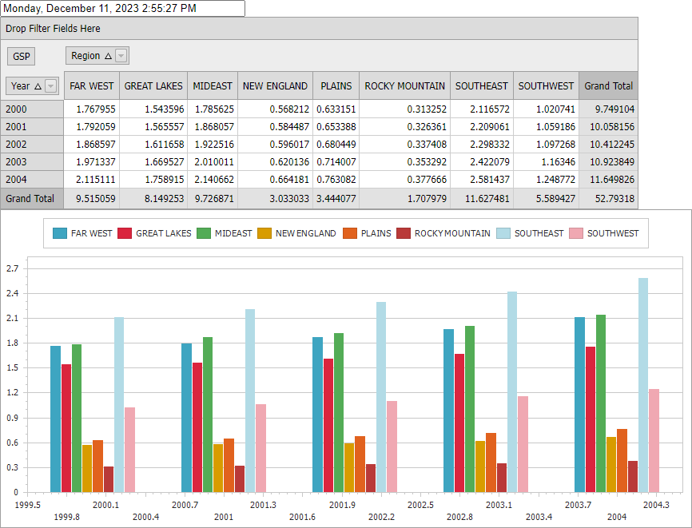

<!-- default badges list -->

<!-- default badges end -->

# Web Forms - How to Link a Web Chart to a Pivot Grid

This tutorial demonstrates how you can link <a href="http://documentation.devexpress.com/#XtraCharts/clsDevExpressXtraChartsWebWebChartControltopic"><u>WebChartControl</u></a> to <a href="http://documentation.devexpress.com/#AspNet/clsDevExpressWebASPxPivotGridASPxPivotGridtopic"><u>ASPxPivotGrid</u></a> at design time.

Note that in order to synchronize both controls when the ASPxPivotGrid layout is changed, it is necessary to set their <strong>EnableCallbacks</strong> property to <i>False</i>. It is possible to place both controls inside the <strong>UpdatePanel</strong> to avoid the entire page update during a postback.

 

## Files to Review

* [Default.aspx](./CS/WebSite/Default.aspx) (VB: [Default.aspx](./VB/WebSite/Default.aspx))
* [Default.aspx.cs](./CS/WebSite/Default.aspx.cs) (VB: [Default.aspx.vb](./VB/WebSite/Default.aspx.vb))

## Documentation

* [UpdatePanel Class](http://msdn.microsoft.com/en-us/library/system.web.ui.updatepanel.aspx)
* [Pivot Charting on the Web (Integration with the ASPxPivotGrid)](http://documentation.devexpress.com/XtraCharts/CustomDocument8750.aspx)
<!-- feedback -->
## Does this example address your development requirements/objectives?

 

(you will be redirected to DevExpress.com to submit your response)
<!-- feedback end -->
